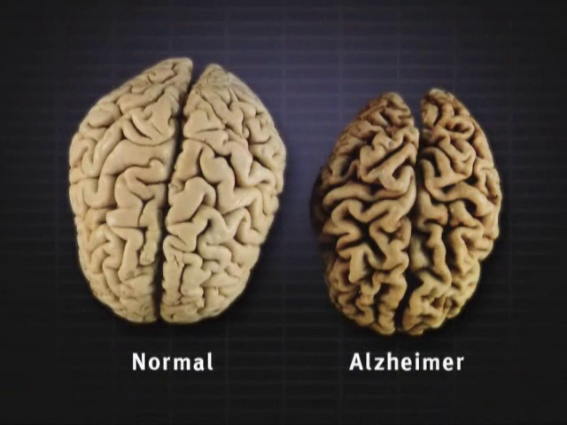
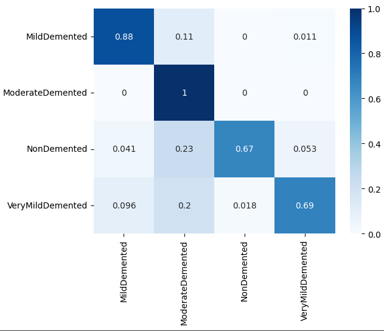
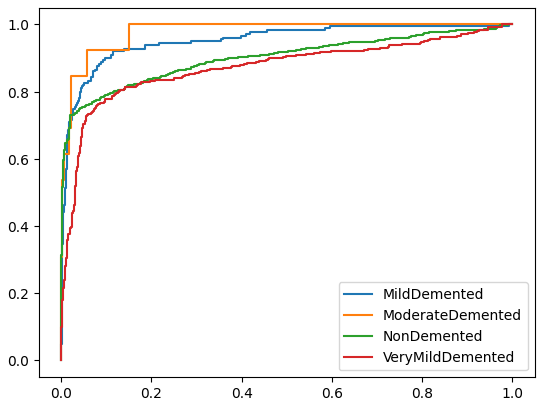

# 2024-1-P2-Alzheimer-MRI


<p align="center">
  
</p>


## Resumo
Esse repositório contém o estudo do mal de Alzheimer com imagens de ressonância magnética do cérebro em um dataset opensource com 6400 imagens divididas entre 4 classes. O trabalho é constituido do tratamento e processamento das imagens, incluindo modelos de ML e seus resultados.


## Sumário

- [Resumo](#resumo)
- [Sumário](#sumário)
- [Base de dados](#base-de-dados)
- [Instalação](#instalação)
- [Como usar](#como-usar)
- [Resultados](#resultados)
- [Licença](#licença)

## Base de dados

Base de dados disponibilizada na plataforma Kaggle sobre as diretrizes da licença "Open Data Commons Open Database License (ODbL) v1.0". Os dados foram levantados manualmente juntando imagens de múltiplas bases de dado. Os dados englobam 6400 imagens de ressonância magnética do cérebro de pessoas divididas nas classes "Mild Demented", "Moderate Demented", "Non Demented" e "Very Mild Demented".

## Instalação

### Ambiente virtual

O pacote `conda` é necessário para criar ambientes virtuais Python. Para instalá-lo siga as instruções disponibilizadas na [Documentação](https://docs.conda.io/projects/conda/en/latest/user-guide/install/index.html).

### Obtendo o projeto

Agora, vamos clonar um repositório Git e criar um ambiente virtual Python:

```bash
# Baixe o projeto
git clone https://github.com/intel-comp-saude-ufes/2024-1-P2-Alzheimer-MRI.git

# Entre na pasta do projeto
cd 2024-1-P2-ALZHEIMER-MRI/

# Crie um ambiente virtual com nome 'alzheimer'
conda create -n alzheimer

# Ative o ambiente virtual
conda activate alzheimer
```

### Instalando as dependências

Uma vez no ambiente virtual, instale as dependências do projeto:

```bash
conda install pip jupyterlab
pip install -r requirements.txt
```

## Como usar

Para abrir os Jupyter Notebooks que contém o projeto, basta utilizar o projeto [JupyterLab computational environment](https://github.com/jupyterlab/jupyterlab) (já consta como dependência desse trabalho). Para executá-lo, basta digitar no terminal: 

```bash
jupyter-lab
```

Então, abra o browser em: [http://localhost:8888/](http://localhost:8888/). O arquivo [notebooks/project](./notebooks/project.ipynb) que contém todo o código desenvoldido do projeto.

## Resultados 

|Matriz de Confusão                           |  Curva ROC                                 |
|:-------------------------------------------:|:-------------------------------------------:
  |  

Nesse trabalho foi possível obter um modelo classificador capaz de classificar diversos níveis de Alzheimer de um paciente, sendo capaz de identificar até mesmo casos mais iniciais da doença. 

Os resultados mostram que os classificadores utilizados tiveram bons resultados e teriam boa aplicabilidade para um modelo em produção. Entretanto, a DenseNet se destacou em todas as métricas utilizadas. Dessa forma, poderia-se utilizar o modelo como ferramenta auxiliar de médicos para a identificação precoce da doença.

## Licença

Este projeto é licenciado sob os termos da [licença MIT](./LICENSE) e está disponível gratuitamente.
